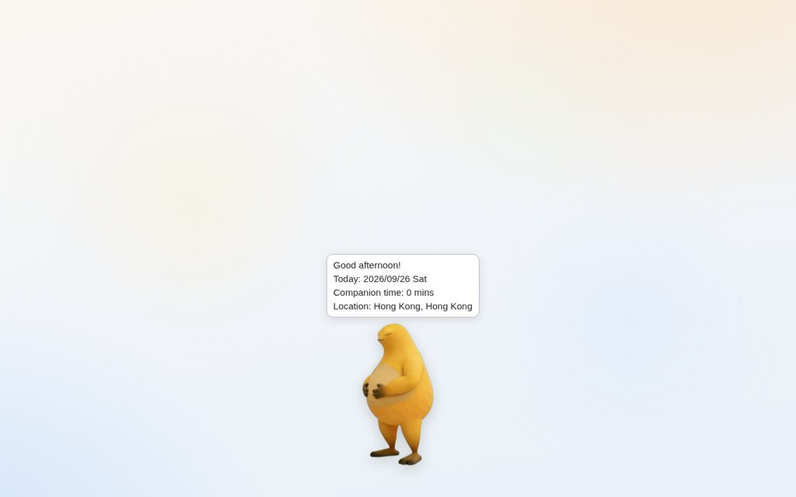
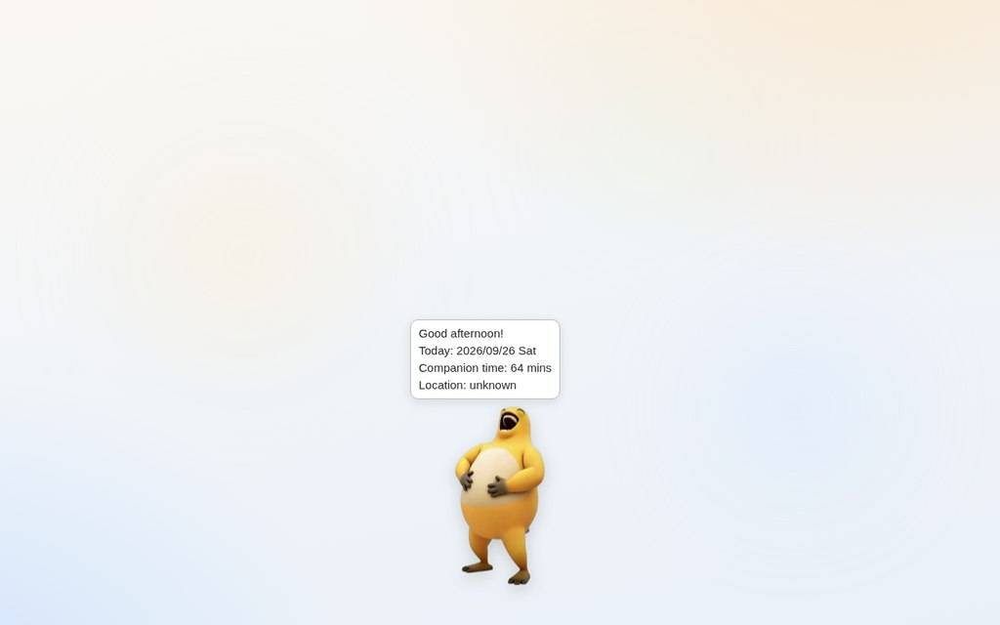
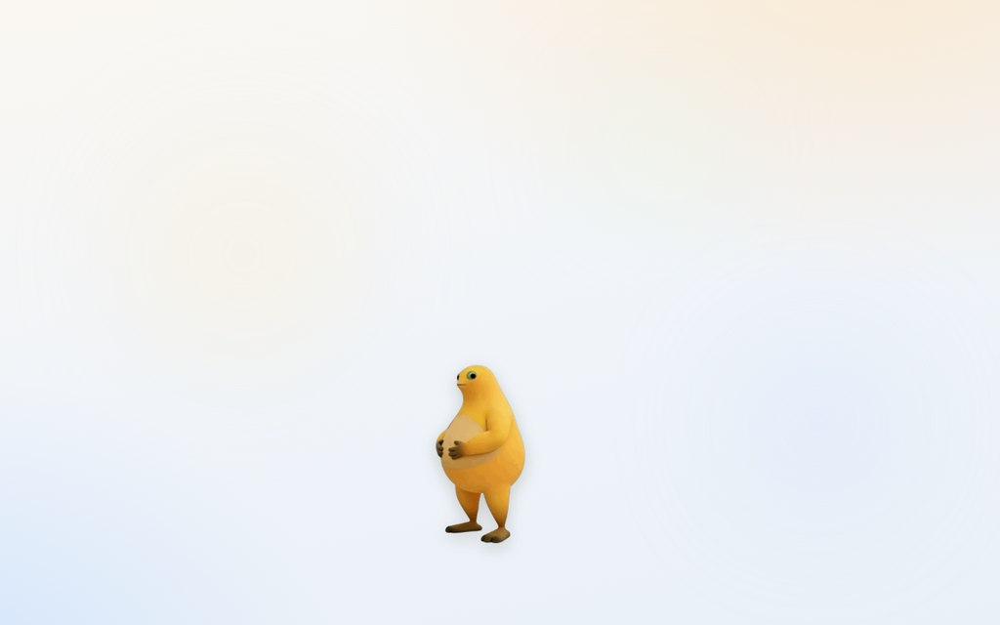

# 奶龙桌宠 · 网页版（Web）

桌面版奶龙的浏览器移植：**零依赖、零构建**，纯 HTML + CSS + 原生 JavaScript，直接复用仓库 `assets/` 目录下的原始素材，不引入任何第三方库，不拷贝任何素材文件。





## 试玩

- **本地直接玩**：用浏览器打开 `web/index.html` 即可（IP 属地查询需要联网，其余功能离线可用）
- **本地静态服务器**：在仓库根目录执行 `python -m http.server 8000`，访问 `http://localhost:8000/web/`
- **GitHub Pages**：仓库 Settings → Pages → 选择 `main` 分支 `/root`，即可通过 `https://<用户名>.github.io/naiwa/web/` 访问

## 功能对照（桌面版 → 网页版）

| 桌面版功能 | 网页版实现 | 状态 |
|---|---|---|
| 帧动画 idle/smile/laugh/cry（12fps） | 完整复用 `assets/` 四套 174 帧素材 | ✅ 一致 |
| 单击微笑（750ms） | 同款判定与时长 | ✅ 一致 |
| 1.5 秒内连点 5 次大笑（5667ms）+ 延迟 300ms 音效 | 同款连击窗口与时长，播放 `assets/sounds/` 原始 MP3 | ✅ 一致 |
| 物理甩动：重力 0.4 / 阻力 0.98 / 反弹 0.70 / 身体矩形碰撞 | 常数与判定逐项对齐，60Hz 固定步长积分 | ✅ 一致 |
| 碰撞形变（squish）：上下 0.4 / 左右 0.2，压缩 100ms + 复原 150ms | 同款两阶段形变 | ✅ 一致 |
| 甩动判定：早/晚段速度趋势（加速才触发） | 同款算法与阈值（trend>30、speed>150、位移>80） | ✅ 一致 |
| CPU/内存过载 → PreCry 1 秒 → 哭泣循环 | 主线程长任务占比 >40% 或 JS 堆 >80% 判定过载 | 🔄 等价替代 |
| 连续使用 60 分钟疲惫 + "Take a break!" 气泡 | 同款 60 分钟与气泡 | ✅ 一致 |
| 打招呼气泡：问候/日期/陪伴时长/IP 属地（20 秒） | 同款四行内容与时长，页面重新可见（≈唤醒）时重新展示 | ✅ 一致 |
| 陪伴时长跨会话持久化（nailong_time.txt） | localStorage 持久化 | 🔄 等价替代 |
| 右键菜单：关闭/托盘/固定/禁用大笑/静音/刷新状态 | 全部保留，另增「模拟系统过载」演示开关 | ✅ 一致+ |
| Escape 退出 | Escape 让奶龙"下班"，可随时召回 | 🔄 等价替代 |

## 与桌面版的差异说明

1. **过载监控**：浏览器沙箱无法读取系统 CPU / 内存，改用两个可观测信号替代——
   - `PerformanceObserver('longtask')` 统计主线程 50ms 以上长任务，占采样窗口（2 秒）时长超过 40% 判定过载（等价于"CPU 被打满"）；
   - Chrome 系浏览器可读 `performance.memory`，JS 堆占用超过 80% 判定过载（对应桌面版"内存 >80%"）。
   - 刻意**不使用帧率阈值**判定：低刷新率、省电模式、软件渲染等"均匀慢"会被误判为过载。
   - 菜单里的「模拟系统过载（演示）」开关可强制进入哭泣状态，方便展示。
2. **最小化到托盘**：浏览器没有系统托盘，最小化后在页面右下角显示悬浮奶龙按钮，点击恢复；最小化期间计时不停（与托盘行为一致）。
3. **IP 属地**：桌面版通过 WinHTTP 请求 ip-api.com；网页端受 CORS 限制，依次尝试 ipwho.is / ipapi.co 两个支持 HTTPS + CORS 的公开源，失败时显示"未知"，不阻塞任何交互。
4. **关闭程序**：网页无法真正"退出"，对应表现为奶龙"下班"卡片，点击按钮或再按一次 Esc 即可召回（陪伴时长已先行保存）。

## 目录结构

```
web/
├── index.html   # 页面骨架（宠物、气泡、菜单、托盘按钮、加载页）
├── style.css    # 简洁桌面风样式（浅色渐变 + 光斑）
├── app.js       # 全部逻辑：状态机 / 物理 / 甩动判定 / 监控 / 持久化 / 菜单
└── docs/        # 截图
```

素材通过相对路径 `../assets/` 引用仓库原始文件，`web/` 目录可整体拷贝到任何能访问素材的位置独立运行。

## 操作方式

| 操作 | 效果 |
|---|---|
| 单击奶龙 | 微笑（750ms）+ 音效 |
| 1.5 秒内连点 5 次 | 大笑（约 5.7 秒）+ 延迟音效 |
| 按住拖动 | 抓起奶龙跟手移动 |
| 快速甩动后松手 | 奶龙被甩飞：重力、空气阻力、边缘弹跳、碰撞形变 |
| 右键奶龙 | 打开菜单（FPS / 陪伴时长 / IP 属地 / 各功能开关） |
| Escape | 奶龙下班（再按一次召回） |
